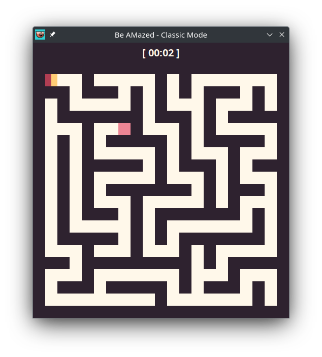
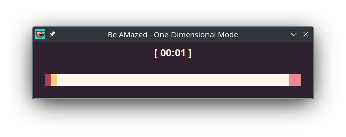
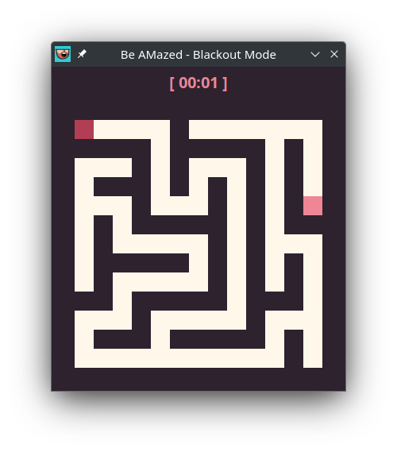
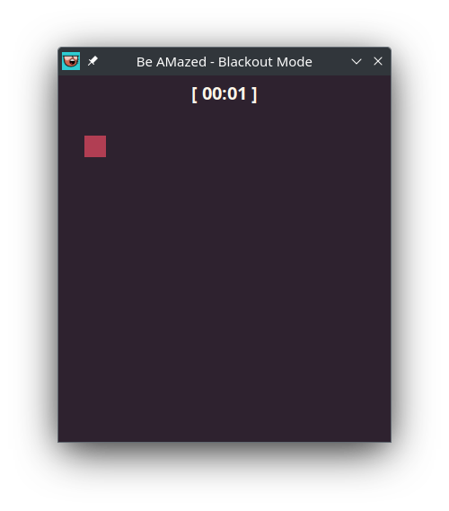

# 2022-SB1-GA-GYTMY

- [2022-SB1-GA-GYTMY](#2022-sb1-ga-gytmy)
  - [Project: `Voice-controlled movement of characters`](#project-voice-controlled-movement-of-characters)
  - [Assigned professor](#assigned-professor)
  - [Students](#students)
  - [What is this project about ?](#what-is-this-project-about-)
  - [Game modes](#game-modes)
    - ["Classic Mode"](#classic-mode)
    - ["One-Dimensional Mode"](#one-dimensional-mode)
    - ["Blackout Mode"](#blackout-mode)

This project was realized by GYTMY for the unit `Projet de programmation (PI4)` during Year 2 Second Semester of `Double Licence Mathématiques-Informatique` (2022-2023).

## Project: `Voice-controlled movement of characters`

## Assigned professor

Sami Boutamine (sami.boutamine@utc.fr)

## Students

| Student ID # | Last Name | First Name | Group | Email |
|:-:|:-:|:-:|:-:|:-:|
| 22103458 | DUDILLIEU | Gabin  | MI2 | gdudillieu@gmail.com |
| 22101699 | IGLESIAS VAZQUEZ | Yago | MI2 | yagoiglesias7@gmail.com |
| 22107803 | SOAN | Tony Ly | MI2 | tony-ly.soan@etu.u-paris.fr |
| 22112498 | SELVAKUMAR | Mathusan | MI2 | mathusan.selvakumar@gmail.com |
| 22103173 | LACENNE | Yanis | MI2 | yanis.lacenne@etu.u-paris.fr |

## What is this project about ?

The goal of this project is to be able to control the movements of characters in a Maze game using real-time voice commands such as saying out loud `Up`, `Down`, `Left` or `Right`.

## Game modes

### "Classic Mode"

A simple single or multi-player mode where you have to reach the end of the maze.

You can also choose the width and the height of the labyrinth.

### "One-Dimensional Mode"

An extremely simple single or multi-player mode where you have to reach the end of the corridor.

### "Blackout Mode"

Lights on             |  Lights out
:-------------------------:|:-------------------------:
 | 

A fun single-player mode where your memory skills will comme in handy to get yourself through the darkness.
