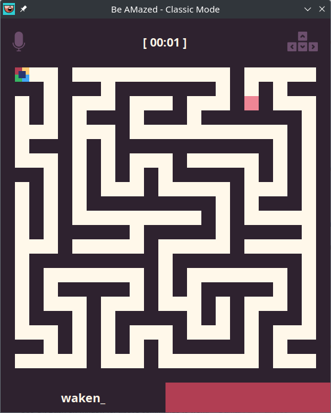

# 2022-SB1-GA-GYTMY

- [2022-SB1-GA-GYTMY](#2022-sb1-ga-gytmy)
  - [Project: `Voice-controlled movement of characters`](#project-voice-controlled-movement-of-characters)
  - [Assigned professor](#assigned-professor)
  - [Students](#students)
  - [What is this project about ?](#what-is-this-project-about-)
  - [Game modes](#game-modes)
    - [`"Classic Mode"`](#classic-mode)
    - [`"Blackout Mode"`](#blackout-mode)
  - [Dependencies](#dependencies)
  - [How to install the dependencies](#how-to-install-the-dependencies)
  - [How to run the game](#how-to-run-the-game)

This project was realized by GYTMY for the unit `Projet de programmation (PI4)` during Year 2 Second Semester of `Double Licence Mathématiques-Informatique` (2022-2023).

## Project: `Voice-controlled movement of characters`

## Assigned professor

Sami Boutamine (<sami.boutamine@utc.fr>)

## Students

| Student ID # |    Last Name     | First Name | Group |                 Email                  |
| :----------: | :--------------: | :--------: | :---: | :------------------------------------: |
|   22103458   |    DUDILLIEU     |   Gabin    |  MI2  |         <gdudillieu@gmail.com>         |
|   22101699   | IGLESIAS VAZQUEZ |    Yago    |  MI2  | <yago.iglesias-vazquez@etu.u-paris.fr> |
|   22107803   |       SOAN       |  Tony Ly   |  MI2  |     <tony-ly.soan@etu.u-paris.fr>      |
|   22112498   |    SELVAKUMAR    |  Mathusan  |  MI2  |    <mathusan.selvakumar@gmail.com>     |
|   22103173   |     LACENNE      |   Yanis    |  MI2  |     <yanis.lacenne@etu.u-paris.fr>     |

## What is this project about ?

The goal of this project is to be able to control the movements of characters in a Maze game using real-time voice commands such as saying out loud `Up`, `Down`, `Left` or `Right`.

## Game modes

### `"Classic Mode"`



A simple single or multi-player mode where you have to reach the end of the maze.

You can also choose the `width` and the `height` of the maze.

### `"Blackout Mode"`

|                         Lights on                          |                        Lights out                        |                          Lights out with player particles                           |
| :--------------------------------------------------------: | :------------------------------------------------------: | :---------------------------------------------------------------------------------: |
|  |  |  |

A fun single-player mode where your memory skills will comme in handy to get yourself through the darkness.

There are 3 difficulties available : `EASY`, `NORMAL` and `HARD`.

## Dependencies

- SPro
- ALIZE (alize_core and LIA_RAL)
- Whisper (and all its dependencies)

## How to install the dependencies

Check the [INSTALL.md](INSTALL.md)

## How to run the game

After installing the dependencies, you will need to compile the game. To do so, you can execute the following command in the root directory of the project, you will to do this only once:

```bash
./run.sh --compile
```

You can then run the game by executing the following command in the root directory of the project:

```bash
./run.sh
```

If the file does not have the right permissions, you can give it the right permissions by executing the following command in the root directory of the project:

```bash
chmod +x run.sh
```

After that you can execute the command above to run the game.
